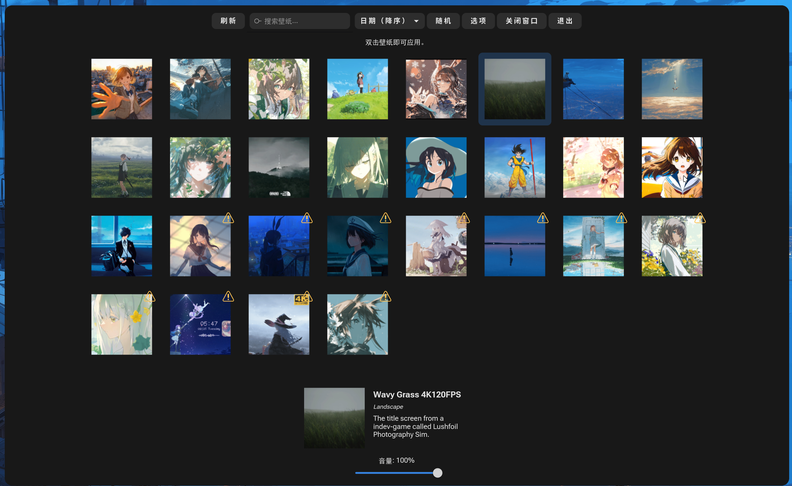
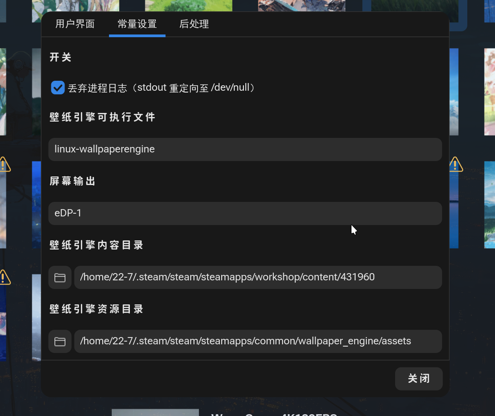
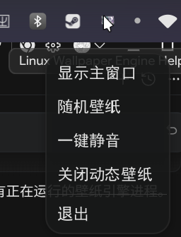

# Linux Wallpaper Engine Helper

> 🎨 基于 [linux-wallpaperengine](https://github.com/Almamu/linux-wallpaperengine) 的 GUI 壁纸管理工具
>
> 原始项目 Fork 自 [6gh/linux-wallpaperengine-helper](https://github.com/6gh/linux-wallpaperengine-helper)，在此基础上进行了大量汉化、功能增强与 Bug 修复。

---

## 📸 截图

<!-- 请在此处放置截图 -->

| 主界面 | 选项页面 |
|:------:|:--------:|
|  |  |

| 系统托盘 & 右键菜单 |
|:-------------------:|
|  |

<!-- 将截图放入项目根目录的 screenshots/ 文件夹中 -->

---

## ✨ 功能特性

### 壁纸管理
- 📂 自动扫描 Steam Workshop 壁纸目录，展示缩略图预览
- 🔍 支持按标题、描述、标签搜索壁纸
- 📊 多种排序方式（按日期、按名称，升序/降序）
- ⭐ 收藏 / 💔 损坏标记系统
- 🎲 一键随机应用壁纸

### 壁纸应用
- 🖥️ 自动检测屏幕输出（无需手动配置 `--screen-root`）
- 🔊 音量控制（0-100，支持静音）
- 💥 崩溃自动检测 — 壁纸引擎崩溃时自动标记为损坏并通知用户
- 📷 后处理支持（截图、swww 集成、自定义命令）

### 系统集成
- 🔔 **系统托盘常驻** — 关闭窗口后最小化到托盘，后台运行
  - 显示 / 隐藏主窗口
  - 随机壁纸
  - 一键静音 / 取消静音
  - 关闭动态壁纸
  - 退出应用
- 🖱️ 右键上下文菜单（应用、收藏、标记损坏、打开目录、复制命令）
- 🔄 单实例运行 — 重复启动会唤醒已有窗口
- 📦 一键安装脚本（`.desktop` 文件 + 图标 + 二进制）

### 界面
- 🇨🇳 全中文界面
- 🖼️ 壁纸缩略图异步加载，不阻塞 UI
- ⚙️ 可配置选项对话框（用户界面 / 常量设置 / 后处理）

---

## 🏗️ 架构

```
linux-wallpaperengine-helper/
├── main.go              # 入口：CLI/GUI 模式分发
├── main_ui.go           # GTK4 主界面：布局、事件、壁纸展示
├── config.go            # 配置定义、读写、校验 (TOML)
├── wallpapers.go        # 壁纸核心逻辑：应用、后处理、崩溃检测
├── options_dialog.go    # 设置对话框 (3 个 Tab)
├── tray.go              # 系统托盘 (StatusNotifier/DBus)
├── processes.go         # 进程管理：启动/终止/查询
├── helpers.go           # 工具函数
├── image.png            # 应用图标
└── install.sh           # 一键构建安装脚本
```

### 技术栈

| 组件 | 技术 |
|------|------|
| 语言 | Go 1.24 |
| GUI | GTK4 ([gotk4](https://github.com/diamondburned/gotk4)) |
| 系统托盘 | [fyne.io/systray](https://github.com/fyne-io/systray) (DBus StatusNotifier) |
| 配置 | TOML ([go-toml/v2](https://github.com/pelletier/go-toml)) |
| 图片处理 | [disintegration/imaging](https://github.com/disintegration/imaging) |
| CLI | [urfave/cli/v3](https://github.com/urfave/cli) |
| 壁纸引擎 | [linux-wallpaperengine](https://github.com/Almamu/linux-wallpaperengine) |

### 数据流

```
Steam Workshop 目录
        │
        ▼
  扫描 project.json ──▶ WallpaperItem[]
        │                      │
        ▼                      ▼
  生成缩略图缓存        GTK4 FlowBox 展示
  (~/.cache/...)               │
                               ▼
                    用户双击 / 右键应用
                               │
                               ▼
                  linux-wallpaperengine 进程
                               │
                    ┌──────────┴──────────┐
                    ▼                      ▼
              崩溃检测 (2s)          后处理流水线
              自动标记损坏        截图 → swww/命令
```

---

## 📋 前置依赖

- **[linux-wallpaperengine](https://github.com/Almamu/linux-wallpaperengine)** — 已安装并在 `$PATH` 中
- **Steam** — 已安装 Wallpaper Engine 及 Workshop 壁纸
- **GTK4 开发库** — `libgtk-4-dev` (Debian/Ubuntu) 或 `gtk4-devel` (Fedora)
- **Go 1.24+**
- *(可选)* **swww** — 用于 Wayland 静态壁纸集成
- *(可选)* **waybar** 或其他支持 StatusNotifier 的状态栏 — 用于显示托盘图标

---

## 🚀 安装

### 一键安装

```bash
git clone https://github.com/YOUR_USERNAME/linux-wallpaperengine-helper.git
cd linux-wallpaperengine-helper
./install.sh
```

脚本会自动：
1. 编译项目
2. 安装二进制到 `~/.local/bin/`
3. 安装图标到 `~/.local/share/icons/`
4. 生成 `.desktop` 文件到 `~/.local/share/applications/`

之后可以从应用启动器搜索 **「Wallpaper Engine Helper」** 启动。

### 手动构建

```bash
go build -o linux-wallpaperengine-helper ./...
./linux-wallpaperengine-helper
```

---

## ⚙️ 配置

配置文件位于 `~/.config/linux-wallpaperengine-helper/config.toml`，首次运行自动生成。

```toml
[Constants]
discard_process_logs = true
linux_wallpaperengine_bin = "linux-wallpaperengine"
wallpaper_engine_dir = "/home/user/.steam/steam/steamapps/workshop/content/431960"
wallpaper_engine_assets = "/home/user/.steam/steam/steamapps/common/wallpaper_engine/assets"
screen_root = ""  # 留空自动检测，或手动指定如 "eDP-1"、"HDMI-A-1"

[PostProcessing]
enabled = false
artificial_delay = 3
screenshot_files = []
post_command = ""
set_swww = false

[SavedUIState]
volume = 100
sort_by = "date_desc"
hide_broken = false
```

> ⚠️ **注意**：应用退出时会覆盖配置文件，请勿在运行时手动编辑。

---

## 🖥️ 兼容性

| Wayland 合成器 | 状态 |
|---------------|------|
| **Niri** | ✅ 已测试 |
| Hyprland | ✅ 应可用 (wlr-layer-shell) |
| Sway | ✅ 应可用 (wlr-layer-shell) |
| KDE Plasma | ⚠️ 建议使用官方 KDE Plugin |
| GNOME | ⚠️ 需要 linux-wallpaperengine X11 模式 |

---

## 📝 与上游的主要差异

相比 [原始项目 (6gh)](https://github.com/6gh/linux-wallpaperengine-helper)：

- 🇨🇳 全界面中文汉化
- 🔔 系统托盘支持（显示/隐藏、随机壁纸、静音、关闭壁纸、退出）
- 🖥️ 屏幕输出自动检测（去除 `HDMI-A-1` 硬编码）
- 💥 壁纸引擎崩溃自动检测与标记
- 🖼️ 修复缩略图加载路径错误
- 🔄 修复刷新按钮不扫描新壁纸的问题
- ⬆️ 修复 `wallpaper_engine_assets` 默认路径
- ✖️ 窗口关闭最小化到托盘，退出按钮真正退出
- 📦 一键构建安装脚本 (`install.sh`)
- 🖼️ 应用图标支持（托盘 + `.desktop`）

---

## 📄 License

本项目基于上游仓库的许可证。详见 [LICENSE](LICENSE) 文件。

---

## 🙏 致谢

- [Almamu/linux-wallpaperengine](https://github.com/Almamu/linux-wallpaperengine) — Linux 下的 Wallpaper Engine 实现
- [6gh/linux-wallpaperengine-helper](https://github.com/6gh/linux-wallpaperengine-helper) — 原始 GUI Helper 项目
- [gotk4](https://github.com/diamondburned/gotk4) — Go 的 GTK4 绑定
- [fyne-io/systray](https://github.com/fyne-io/systray) — 跨平台系统托盘库
